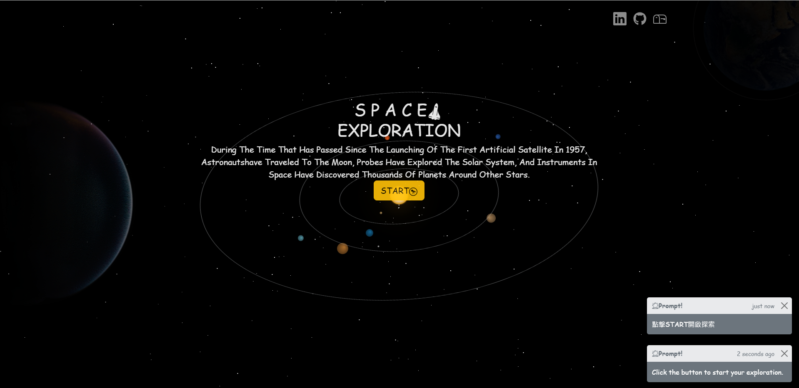

# Space-exploration

由動畫的方式帶入星系介紹頁面就像在身在太空一樣，串接NASA API資料總共介紹5顆星系相關
圖檔，並可以分頁查詢前後資料，點擊圖片可進行縮放。

## Demo

   

   

## 使用技術

* React、Bootstrap、Pubsub.js

## 背景動畫

[@flodlc/nebula](https://github.com/flodlc/nebula)

